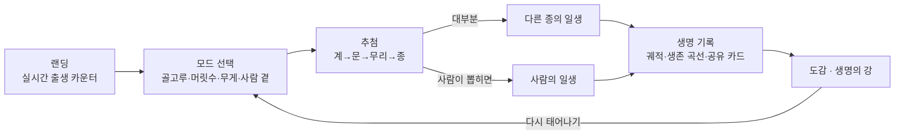

# 이번 생은 — 기획서

2026-10-08

## 개요

「이번 생은」은 지구의 동물 수백해(10²⁰) 마리 중 하나로 무작위로 태어나 그 일생을 살아보는 웹 시뮬레이션이다. 사람도 그중 한 종으로 포함된다.

- **깨는 착각**: "태어난다 = 사람으로 태어난다". 개체 수로 뽑으면 사람일 확률은 수백억\~수천억 분의 1이다.
- **레퍼런스**: [1in8b.life](https://1in8b.life/) — 실제 통계 비례 추첨, 실시간 진행, 같은 조건의 다른 삶 병렬 표시, 담담한 마무리(추모관), 데이터 투명성.
- **가져오는 원칙**: 추첨 대상만 '나라'에서 '종'으로 바꾸고 나머지 다섯 원칙은 유지한다.
- **목표 경험**: 한 판 5\~15분, 반복 플레이로 도감을 채우며 생명의 분포를 체감한다.

## 뽑기 모드

뽑기 기준을 3개로 나눠, 기준만 바꿔도 세상이 다르게 보이게 한다. 순수 개체 수만 쓰면 거의 매번 선충이 나오기 때문이다.

| 모드 | 기준 | 주로 나오는 생명 | 사람일 확률(개략) |
| --- | --- | --- | --- |
| ① 머릿수 (기본) | 개체 수 비례 | 선충·요각류 99% 이상, 그다음 곤충 | \~0.000000001% |
| ② 무게 | 생물량(탄소량) 비례 | 절지동물, 물고기, 환형동물, 사람·가축 | 약 2\~3% |
| ③ 사람 곁 | 사람 + 사람이 기르는 동물 | 닭, 양식어, 소, 양, 돼지, 사람 | 약 10\~20% |

- 첨 삶은 ①로 시작한다. 선충으로 몇 주를 산 뒤 "다시 태어나기"와 다른 모드를 권한다.
- 표의 확률은 기획용 개략값이다. 구현 시 출처별 추정 범위를 표시하고 중앙값을 쓴다.
- 추첨은 2단계다: 분류군 확률로 군을 고른 뒤, 군 안의 대표종으로 플레이한다.

## 사용자 흐름

한 번의 삶은 추첨에서 갈라지고, 기록 뒤 "다시 태어나기"로 모드 선택으로 돌아와 반복 플레이를 만든다.

- **추첨 연출**: 계부터 종까지 좍혀가며 단계별 확률을 함께 표시한다.
- **출생**: 서식지, 형제 수, 같은 해 생존 확률을 보여준다.
- **사건**: 먹이, 포식자, 날씨, 번식, 사람과의 마주침. 대부분 자동, 결정적 순간만 선택.
- **잠시 멈춤**: 생애 주요 지점에서 질문 하나에 한 줄을 남긴다.
- **생명의 강**: 모두의 삶이 종별 색 점으로 흐르고, 점마다 한마디를 남길 수 있다(원본의 추모관).

## 사람으로 뽑혔을 때

사람은 가장 희귀한 결과로, 별도의 간소화된 인생(약 15분)을 산다.

- 나라는 실제 출생아 수에 비례해 정하고, 수명은 그 나라·성별 생명표를 따른다.
- 끝날 때 "당신은 X억 분의 1 확률로 사람이었습니다"를 보여준다.
- 삶 도중 다른 생명과 마주치는 장면(먹은 닭, 길의 개미)을 넣고, 이미 살아 본 종이면 도감과 연결한다.
- 1in8b의 구조를 베끼지 않도록, 사람 파트는 '다른 종과 나란히 놓인 한 종'의 관점으로 짧게 유지한다.

## 상태 지표

모든 종이 같은 4개 지표(0\~100)를 쓴다. 수치는 가능성만 바꾸고 결과를 정하지 않는다.

| 지표 | 오르는 요인 | 내리는 요인 |
| --- | --- | --- |
| 에너지 | 먹이, 사냥, 사료 | 굶주림, 이동, 번식 |
| 안전 | 은신, 무리, 보호 | 포식, 질병, 어업·도축·서식지 파괴 |
| 번식 | 짝, 알, 새끼 | 고립, 환경 악화 |
| 환경 | 적정 온도, 서식지 유지 | 가뭄, 한파, 오염 |

- 사건은 대부분 본능에 따라 자동 진행하고, 결정적 순간 2\~4번만 선택하게 한다.
- 사람은 4개 지표를 건강·행복·돈·관계로 치환한다.

## MVP 종 목록

1차는 대표종 20종이다. 플레이 시간은 실제 수명과 관계없이 5\~15분으로 압축하고, 실제 시간 카운터를 함께 둔다.

| 분류군 | 대표종 | 서식지 |
| --- | --- | --- |
| 토양·미소동물 | 선충, 요각류, 지렁이 | 흙, 바다 |
| 곤충 | 개미, 모기, 하루살이, 꿀벌 | 땅, 물가, 하늘 |
| 바다 생물 | 남극 크릴, 멸치, 대구, 연어, 양식 연어 | 바다, 양식장 |
| 새 | 참새, 닭(육계·산란계) | 도시, 농장 |
| 포유류 | 쥐, 박쥐, 소, 돼지, 혹등고래, 사람 | 도시, 동굴, 농장, 바다 |

수명 폭은 하루살이(성체 수시간)부터 육계(약 6주), 사람(약 73년), 혹등고래(수십 년)까지다.

## 데이터 출처 (후보)

아래는 기억에 기반한 후보 목록이며, 데이터 조사 단계에서 원문을 확인하고 수치를 확정한다.

| 용도 | 출처 |
| --- | --- |
| 생물량(무게 모드) | Bar-On et al. 2018, PNAS |
| 선충 개체 수 | van den Hoogen et al. 2019, Nature |
| 개미 개체 수 | Schultheiss et al. 2022, PNAS |
| 야생 조류 | Callaghan et al. 2021, PNAS |
| 야생 포유류 | Greenspoon et al. 2023, PNAS |
| 가축·양식·어업 | FAO (FAOSTAT, SOFIA) |
| 사람(출생·생명표) | UN 세계인구전망(WPP) |
| 수명·생존 곡선 | AnAge 데이터베이스, 종별 문헌 |

추정 편차가 큰 항목(요각류, 중층 어류 등)은 화면에 범위로 표시한다.

## 톤·레이아웃·시각 장치

담담하고 판단하지 않는 톤으로, 텍스트 중심의 미니멀한 화면을 쓴다.

- **톤**: 도축·포식도 통계대로 다루되 묘사는 절제한다. 초등학생부터 대상. 죽음·출하는 한 문장 사실로만 쓰고 묘사하지 않는다.
- **랜딩**: 히어로 → 실시간 카운터("이 페이지를 연 뒤 태어난 생명: 사람 N명 · 닭 N마리 · 곤충 약 N마리") → 모드 선택 → 생명의 강 → 도감 → 데이터 설명, 세로 한 줄.
- **진행 화면**: 상단 바(나이/일수 · 재생 · 배속 · 자동 · 음악), 중앙 장면 텍스트, 하단 생애 타임라인과 형제 점 격자.
- **형제 점 격자**: 같은 순간 태어난 형제가 점으로 표시되고 하나씩 꺼진다. 생존 곡선 Ⅰ·Ⅱ·Ⅲ형을 설명 없이 체감하게 한다.
- **배율**: 몸 크기에 따라 화면 배율이 바뀐다(선충은 현미경 시야, 고래는 넓은 바다).
- **색**: 무채색 기반, 서식지별 배경색(흙·바다·하늘·농장·도시). 명조 계열 서체.
- **공유 카드**: "이번 생은 남극 크릴로 태어나 214일을 살았습니다."

## 기술·범위·로드맵

Next.js + Supabase + Vercel로 1차 MVP를 만들고, 개인 기록은 로그인 없이 기기에만 저장한다.

| 단계 | 범위 |
| --- | --- |
| 1차 MVP | 20종, 3개 모드, 종별 사건 10\~15개, 공유 카드, 생명의 강(Supabase) |
| 2차 | 종 확대, 도감 고도화, 다국어(한·영) |
| 3차 | "과거 지구" 모드(1만 년 전), 다음 생으로 이어지는 윤회 기록 |

### 열린 질문

- [ ] 추정 편차가 큰 요각류·어류 개체 수를 어떤 값으로 확정할지
- [ ] 양식어를 '사람 곁' 모드에 포함할지(사람 확률이 10%와 20% 사이로 크게 바뀜)
- [ ] 도축 장면의 수위와 연령 기준
- [ ] 서비스 이름 확정(「이번 생은」 가제) 및 도메인

## 현재 구현 상태 (2026-10-08)

| 항목 | 상태 |
| --- | --- |
| 정적 웹앱 (`index.html`, `app.js`, `art.js`) | 완료 |
| 20종 삶의 궤적 데이터 (`data/<id>.js`, 형식 `data/SCHEMA.md`) | 완료, 생물학 검수 필요 |
| 모드 4개 (기획서 3개 + 「골고루」 기본값) | 완료 |
| 사람: 20개국 통계, 소득 수준별 사건, 다른 종과의 만남 | 완료 |
| 생명 기록: 궤적 타임라인, 생존 곡선, 공유 카드 | 완료 (이미지 저장은 없음) |
| 도감·기록 저장 | localStorage만 |
| 생명의 강 공유, 한마디 공유 | 미구현 (Supabase 필요) |
| Next.js 전환, Vercel 배포 | 미구현 |
| 연령 기준 | 초등학생부터로 결정 |
